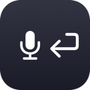

<p align="center">
  
</p>

# Dictation Enter

A macOS menu bar utility that automatically presses Enter for you when you finish dictating (with Wispr Flow or similar).

When you hold a trigger key (default: Fn) to dictate, Dictation Enter detects the release and sends an Enter keypress after a configurable delay. This lets you dictate into text fields and chat apps without needing to manually confirm with Enter afterward.

## Requirements

- macOS 13.0 or later
- Accessibility permission (the app will prompt you on first launch)

## Installation

Download the DMG from the [latest release](../../releases/latest), open it, and drag Dictation Enter into Applications.

## Usage

> [!WARNING]
> If the app doesn't seem to be working, try quitting it and relaunching it from Finder (Applications). You may need to right-click the app and select **Open** to bypass macOS permission/Gatekeeper issues.

Once running, Dictation Enter appears as a 🎙️⏎ icon in your menu bar. Click it to:

- **Enable/Disable** the app
- **Open Preferences** to configure the trigger key, timing, and launch-at-login

<p align="center">
  
</p>

### Trigger

By default, the trigger is the **Fn** key. You can change it to any key combination or a mouse button in Preferences.

### Timing

The delay before Enter is pressed is controlled by three parameters:

- **Base Wait Time** -- minimum delay after releasing the trigger (for short presses).
- **Threshold** -- hold duration below which the base wait time applies.
- **Scale** -- for every N extra seconds of hold beyond the threshold, add 1 second of wait time.

For holds shorter than the threshold, the wait time equals the base wait time. For longer holds, the wait time increases proportionally.

## Building

The entire app is a single Swift file compiled with `swiftc`. Run the build script:

```
./build.sh
```

This will:

1. Generate the app icon (if `AppIcon.icns` doesn't exist)
2. Compile `DictationEnter.swift`
3. Create the `.app` bundle and ad-hoc code sign it
4. Generate the DMG background image (if `dmg_background.png` doesn't exist)
5. Create a styled DMG installer at `DictationEnter.dmg`

To force regeneration of the icon or DMG background, delete the respective file before running `build.sh`.

### Creating a release

After building, create a GitHub release with the DMG attached:

```
gh release create v1.x DictationEnter.dmg --title "v1.x" --notes "Release notes here."
```

## License

MIT
